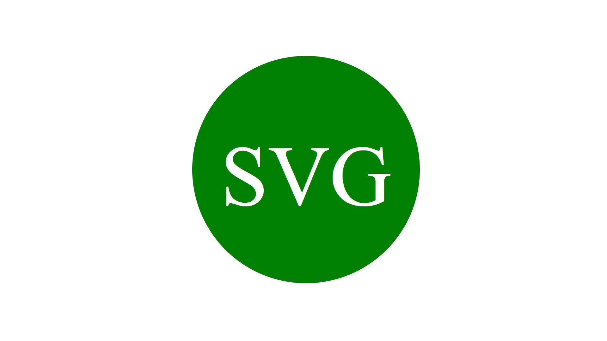

# svg_logo_maker

  * Author: Kyosook Shin
  * Author's Email: kyosook.shin@gmail.com  
  * GitHub: https://github.com/alla0810/readme_generator
  * Walkthrough Video
    https://drive.google.com/file/d/11Jq09KdMogAlfzqCMzKKjAHJSA6fbtv5/view

  * screenshot

## Source Code References
  This project has used some reference codes from the following sites

   * https://git.bootcampcontent.com/University-of-Texas-at-Austin/UTA-VIRT-FSF-PT-07-2023-U-LOLC.git   

   
## User Story

AS a freelance web developer
I WANT to generate a simple logo for my projects
SO THAT I don't have to pay a graphic designer

## Acceptance Criteria

GIVEN a command-line application that accepts user input

* WHEN I am prompted for text, THEN I can enter up to three characters

* WHEN I am prompted for the text color, THEN I can enter a color keyword ( OR a hexadecimal number)

* WHEN I am prompted for a shape, THEN I am presented with a list of shapes to choose from: circle, triangle, and square

* WHEN I am prompted for the shape's color, THEN I can enter a color keyword (OR a hexadecial number)

* WHEN I have entered input for all the prompts, THEN an SVG file is created named 'logo.svg', AND the output text "Generated logo.svg" is printed in the command line

* WHEN I open the 'logo.svg' file in a brower, THEN I am shown a 300x200 pixel image that matches the criteria I entered

## Mock-Up
The following image shows a mock-up of the generated SVG given the following input entered by the user: svg for the text, white for the text color, circle from the list of shapes, and green for the shape color.  Note that this is just an image of the output SVG and not the SVG file itself

## Deliverables: 15%
* At least one sample SVG file generated using the application must be submitted
* Your GitHub repository containing your application code.

## Walkthrough Video: 32%
* A walkthrough video that demonstrates the functionality of the SVG logo maker and passing tests must be submitted.

* The README.md file must include a link to the walkthrough video.

* The walkthrough video must show all tests passing from the command line.

* The walkthrough video must demonstrate how a user would invoke the application from the command line.

* The walkthrough video must demonstrate how a user would enter responses to all of the prompts in the application.

* The walkthrough video must demonstrate a generated SVG file, showing the file being opened in the browser.  The image in the browser must reflect the choices made by the user (text, shape, and colors).

## Technical Acceptance Criteria: 40%

Satisfies all of the above acceptance criteria plus the following:
* Uses the Inquirer package
* Uses the Jest package for a suite of unit tests.
* The appilcation must have Triangle, Square, and Circle classes

## Repository Quality: 13%

* Repository has a unique name.
* Repository follows best practices for file structure and naming conventions.
* Repository follows best practices for class/id naming conventions, indentation, high-quality comments, etc.
* Repository contains multiple descriptive commit messages.
* Repository contains a high-quality README file with description, a link to walkthrough video.
